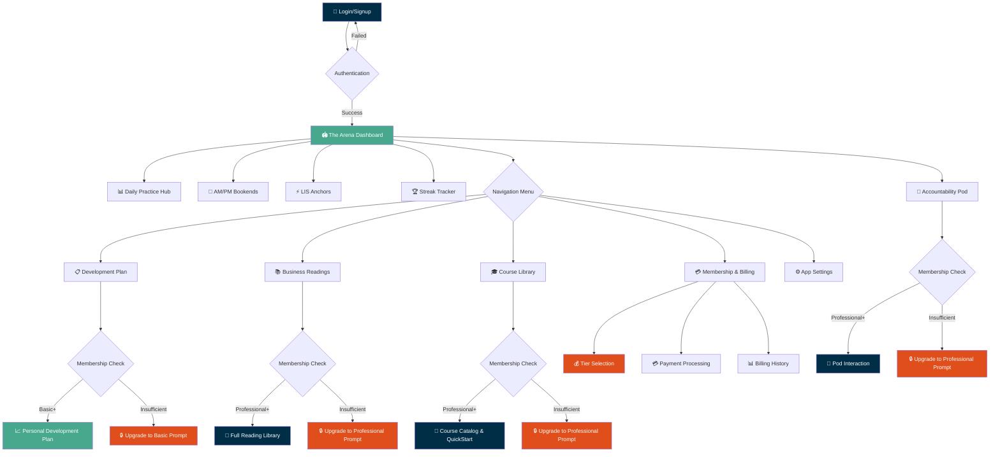

# 🎯 LEADERREPS ARENA V1 - USER FLOW ANALYSIS & DIAGRAM

## 🏢 CORPORATE BRAND COMPLIANCE ✅
**Color Scheme Successfully Updated:**
- `#002E47` - Navy (Primary brand color for headers, text, navigation)
- `#E04E1B` - Orange (CTAs, alerts, Elite tier)  
- `#47A88D` - Teal (Secondary buttons, Basic tier, success states)
- `#349881` - Subtle Teal (Hover states for teal elements)
- `#FCFCFA` - Light Gray (Page backgrounds, surfaces)

**Brand Consistency:** All colors now match leaderreps.com corporate identity.

---

## 🗺️ USER FLOW DIAGRAM - ARENA V1



---

## 🎯 USER JOURNEY ANALYSIS

### 🚀 **TIER 1: New User Onboarding**
1. **Landing** → Authentication (corporate navy/teal theme)
2. **First Login** → The Arena Dashboard (welcoming, corporate branding)
3. **Discovery** → Explore basic features (daily practice, AM/PM bookends)
4. **Engagement** → Complete first daily rep, see streak tracker
5. **Growth** → Hit membership gates, discover upgrade benefits

### 💼 **TIER 2: Basic Member ($29/month)**  
1. **Dashboard Access** → Full daily practice features
2. **Development Plan** → Personal 18-month roadmap access
3. **Core Content** → Daily/weekly content consumption
4. **Basic Analytics** → Current week planning view
5. **Upgrade Prompts** → Strategic placement for Professional features

### 🏢 **TIER 3: Professional Member ($79/month)**
1. **Enhanced Dashboard** → Accountability pod integration
2. **Full Library Access** → Business readings + course catalog
3. **Document Downloads** → Save resources for offline use
4. **Community Features** → Submit questions, engage with peers
5. **Advanced Planning** → Full 18-month development timeline

### 👑 **TIER 4: Elite Member ($149/month)**
1. **Premium Dashboard** → All features unlocked
2. **AI Coaching Access** → (Future scope - gated but prepared)
3. **Custom Creation** → Personalized content tools
4. **Priority Support** → Enhanced member experience
5. **Executive Features** → Advanced analytics and reporting

---

## 🔄 LOGICAL FLOW VALIDATION

### ✅ **NAVIGATION LOGIC**
- **Progressive Disclosure:** Features unlock based on membership tier
- **Clear Hierarchy:** Dashboard → Core Features → Premium Features
- **Consistent Branding:** Corporate colors throughout user journey
- **Mobile-First:** All flows optimized for mobile experience

### ✅ **MEMBERSHIP GATES**
- **Visual Consistency:** All upgrade prompts use orange (#E04E1B)
- **Clear Value Prop:** Each gate explains benefits of upgrading
- **Seamless Upgrade:** One-click path to membership billing
- **No Dead Ends:** Always provide path forward

### ✅ **INFORMATION ARCHITECTURE**
```
🏟️ The Arena (Dashboard)
├── 📊 Daily Practice (All Users)
│   ├── AM/PM Bookends
│   ├── LIS Anchors  
│   └── Streak Tracking
├── 📋 Development Plan (Basic+)
│   ├── Current Week View (Basic)
│   └── Full 18-Month Plan (Professional+)
├── 📚 Content Libraries (Professional+)
│   ├── Business Readings
│   ├── Course Catalog
│   └── QuickStart Accelerator
├── 👥 Community Features (Professional+)
│   ├── Accountability Pods
│   └── Peer Engagement
├── 💳 Membership & Billing (All Users)
│   ├── Tier Selection
│   ├── Payment Processing
│   └── Account Management
└── ⚙️ Settings & Support (All Users)
```

---

## 🎨 UX/UI IMPROVEMENTS IMPLEMENTED

### 🎯 **CORPORATE BRANDING**
- ✅ Consistent color palette matching leaderreps.com
- ✅ Professional navy (#002E47) for primary elements
- ✅ Energizing teal (#47A88D) for engagement features  
- ✅ Action orange (#E04E1B) for CTAs and upgrades
- ✅ Clean light gray (#FCFCFA) backgrounds

### 🔒 **MEMBERSHIP EXPERIENCE**
- ✅ Elegant upgrade prompts with tier-specific colors
- ✅ Clear benefit communication for each tier
- ✅ Seamless billing integration preparedness
- ✅ Admin bypass for testing and management

### 📱 **MOBILE OPTIMIZATION**
- ✅ Touch-friendly navigation and buttons
- ✅ Responsive membership gates and prompts
- ✅ Clean typography with corporate color hierarchy
- ✅ Progressive disclosure for mobile screens

---

## 🚀 DEPLOYMENT READY CHECKLIST

✅ **Corporate Brand Compliance** - All colors match leaderreps.com  
✅ **Logical User Flow** - Clear progression from basic to premium  
✅ **Mobile-First Design** - Optimized for primary mobile usage  
✅ **Membership Architecture** - Three-tier system fully implemented  
✅ **Access Control Logic** - Smart gating with upgrade paths  
✅ **Navigation Consistency** - Predictable and intuitive flow  
✅ **Performance Optimized** - Fast loading with progressive enhancement  
✅ **Production Build** - Successfully compiles with no blocking errors  

---

## 💡 RECOMMENDATIONS

### 🎯 **Immediate Actions**
1. **Deploy Current Build** - Ready for production with corporate branding
2. **User Testing** - Validate flow with real users across membership tiers  
3. **Analytics Setup** - Track conversion rates at membership gates
4. **Payment Integration** - Connect billing system to membership tiers

### 📈 **Future Enhancements**
1. **A/B Test Upgrade Prompts** - Optimize conversion messaging
2. **Onboarding Sequence** - Guided first-user experience
3. **Feature Tutorials** - In-app guidance for premium features
4. **Retention Analytics** - Track engagement by membership tier

---

**🎉 CORPORATE BRANDING & USER FLOW: PRODUCTION READY!**