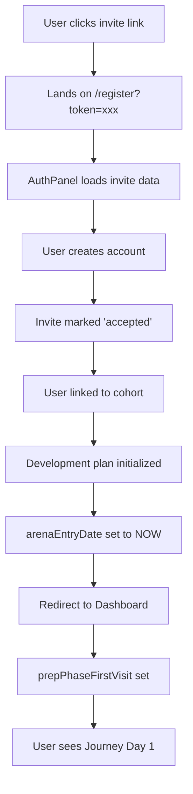

# User Management Integration Plan
## Cohort → Invite → Dashboard → Locker Integration

**Created:** December 16, 2025  
**Status:** Architecture Design  
**Related Systems:** UserManagement, Dashboard, Locker, Progressive Onboarding

---

## 1. Executive Summary

This document outlines how to tie together:
1. **User Management** - Admin creates cohorts, sends invites
2. **Dashboard** - User sees personalized welcome, progressive onboarding
3. **Locker** - User's profile data, cohort info, journey progress

### The Core Principle
> **Every user gets a personalized 5-day onboarding experience, regardless of when they join the cohort.**

A user who joins on Prep Day 12 gets "Journey Day 1" content. A user who joins on Prep Day 1 gets the same "Journey Day 1" content. This ensures no one feels behind or overwhelmed.

---

## 2. Current State Analysis

### 2.1 User Management (`UserManagement.jsx`)
**Location:** [src/components/admin/UserManagement.jsx](src/components/admin/UserManagement.jsx)

Currently supports:
- ✅ Create Cohorts (name, start date)
- ✅ Send Invitations (email, name, role, cohort, custom message)
- ✅ List Users with cohort assignment
- ✅ Invite link generation with token
- ✅ Accept invite flow in AuthPanel

**Missing:**
- ❌ Bulk invite uploads (CSV)
- ❌ Email sending (creates invite record only)
- ❌ Cohort details (facilitator, description, max capacity)
- ❌ User journey tracking in admin view
- ❌ Re-send invite functionality

### 2.2 Dashboard (`Dashboard.jsx`)
**Location:** [src/components/screens/Dashboard.jsx](src/components/screens/Dashboard.jsx)

Currently supports:
- ✅ Progressive onboarding (Journey Days 1-5)
- ✅ `PrepWelcomeBanner` with countdown and quotes
- ✅ Day-based widget visibility
- ✅ Phase detection (Prep, Development Plan, Post)

**Missing:**
- ❌ First-time user detection/handling
- ❌ Welcome message personalization with cohort name
- ❌ Facilitator introduction
- ❌ Cohort peer visibility

### 2.3 Locker (`Locker.jsx`)
**Location:** [src/components/screens/Locker.jsx](src/components/screens/Locker.jsx)

Currently supports:
- ✅ `locker-controller` widget (user info, start date)
- ✅ Progress tracking
- ✅ History widgets (wins, scores, reflections)

**Missing:**
- ❌ Cohort information display
- ❌ Journey progress visualization
- ❌ Onboarding status
- ❌ Facilitator contact

---

## 3. Proposed Data Model

### 3.1 Firestore Collections

```
/cohorts/{cohortId}
├── name: string
├── description: string
├── startDate: timestamp
├── endDate: timestamp (calculated: startDate + 70 days)
├── facilitator: {
│   ├── uid: string
│   ├── name: string
│   ├── email: string
│   └── photo: string
│   }
├── settings: {
│   ├── maxCapacity: number
│   ├── allowLateJoins: boolean
│   ├── lateJoinCutoff: number (days before start)
│   └── sendWelcomeEmail: boolean
│   }
├── stats: {
│   ├── totalInvited: number
│   ├── totalAccepted: number
│   └── totalActive: number
│   }
├── createdAt: timestamp
└── createdBy: string

/invitations/{inviteId}
├── email: string
├── name: string
├── role: string
├── cohortId: string
├── customMessage: string
├── token: string (unique)
├── status: 'pending' | 'accepted' | 'expired' | 'cancelled'
├── createdAt: timestamp
├── createdBy: string
├── expiresAt: timestamp
├── acceptedAt: timestamp (when accepted)
├── acceptedBy: string (uid when accepted)
├── emailSentAt: timestamp (when email sent)
└── emailSentCount: number

/users/{userId}
├── displayName: string
├── email: string
├── photoURL: string
├── role: string
├── cohortId: string
├── inviteId: string (reference to original invite)
├── arenaEntryDate: timestamp  ← NEW: When user first accessed the arena
├── prepPhaseFirstVisit: timestamp  ← Already exists: Journey Day calculation
├── onboardingStatus: {
│   ├── journeyDay: number
│   ├── completedModules: ['welcome', 'bookends', ...]
│   ├── lastVisit: timestamp
│   └── isAccelerated: boolean
│   }
├── profileComplete: boolean
├── assessmentComplete: boolean
├── disabled: boolean
└── createdAt: timestamp

/modules/{userId}/development_plan/current
├── startDate: timestamp (from cohort)
├── prepPhaseFirstVisit: timestamp (for journey tracking)
├── dayNumber: number
├── weekNumber: number
└── phase: 'pre-start' | 'start' | 'post-start'
```

### 3.2 Key Timestamps Explained

| Timestamp | Purpose | Set When |
|-----------|---------|----------|
| `cohort.startDate` | When the 8-week program officially starts | Admin creates cohort |
| `user.arenaEntryDate` | When user first logged into the app | First successful login |
| `user.prepPhaseFirstVisit` | When user first visited during Prep Phase | First Dashboard load in Prep Phase |
| `invite.acceptedAt` | When user accepted the invitation | Signup with invite token |

---

## 4. User Journey Flow

### 4.1 Admin Creates Cohort

```mermaid
graph TD
    A[Admin opens User Management] --> B[Clicks "New Cohort"]
    B --> C[Enters cohort details]
    C --> D[Cohort created in Firestore]
    D --> E[Cohort appears in list]
```

**Enhanced Cohort Form Fields:**
- Cohort Name (required)
- Description (optional)
- Start Date (required)
- Facilitator (dropdown of admin users)
- Max Capacity (optional)
- Allow Late Joins (checkbox)
- Late Join Cutoff (days before start)

### 4.2 Admin Sends Invites

```mermaid
graph TD
    A[Admin clicks "Invite User"] --> B[Enters email, name, cohort]
    B --> C[Creates invitation record]
    C --> D{Send Email?}
    D -->|Yes| E[Cloud Function sends email]
    D -->|No| F[Manual link copy]
    E --> G[Invite link in email]
    F --> G
```

**Invite Options:**
- Single invite (current)
- Bulk upload (CSV: email, name, role)
- Re-send invite
- Copy invite link

### 4.3 User Accepts Invite & First Login



### 4.4 Progressive Onboarding (Already Built)

| Journey Day | Content Introduced | Widgets Shown |
|-------------|-------------------|---------------|
| Day 1 | Welcome, Profile, Assessment | `LeaderProfile`, `BaselineAssessment`, `TodaysActions` |
| Day 2 | AM & PM Bookends | `AMBookend`, `PMBookend` |
| Day 3 | Reading Library | `ReadingContent` |
| Day 4 | Video Library | `VideoContent` |
| Day 5 | Full App Overview | `AppOverview`, all features |

**Late Joiner Handling:**
- 3-4 days until start → **Accelerated** (2 sessions)
- 0-2 days until start → **Quick Start** (1 session with essentials)

---

## 5. Implementation Plan

### Phase 1: Enhanced Cohort Management (Priority: HIGH)

**File:** [src/components/admin/UserManagement.jsx](src/components/admin/UserManagement.jsx)

1. **Expand Cohort Schema**
   ```javascript
   const cohortForm = {
     name: '',
     description: '',
     startDate: '',
     facilitatorId: '', // Admin user ID
     maxCapacity: null,
     allowLateJoins: true,
     lateJoinCutoff: 3 // Days before start
   };
   ```

2. **Add Cohort Detail View**
   - Show all invited users and their status
   - Show accepted users and their journey progress
   - Re-send invite button
   - Copy invite link button

3. **Bulk Invite Upload**
   ```javascript
   // CSV Format: email,name,role
   // Example:
   // john@company.com,John Doe,user
   // jane@company.com,Jane Smith,coach
   ```

### Phase 2: First-Time User Experience (Priority: HIGH)

**Files:**
- [src/components/auth/AuthPanel.jsx](src/components/auth/AuthPanel.jsx)
- [src/hooks/useDailyPlan.js](src/hooks/useDailyPlan.js)
- [src/components/widgets/PrepWelcomeBanner.jsx](src/components/widgets/PrepWelcomeBanner.jsx)

1. **Set Arena Entry Date on First Login**
   ```javascript
   // In AuthPanel.jsx after signup
   await setDoc(userRef, {
     cohortId: inviteData.cohortId,
     arenaEntryDate: serverTimestamp(),
     onboardingStatus: {
       journeyDay: 0,
       completedModules: [],
       lastVisit: null,
       isAccelerated: false
     }
   }, { merge: true });
   ```

2. **Personalized Welcome Message**
   ```javascript
   // In PrepWelcomeBanner.jsx
   const welcomeMessage = useMemo(() => {
     if (journeyDay === 1) {
       return `Welcome to ${cohort?.name || 'the Arena'}, ${user?.displayName?.split(' ')[0]}! 
               Your facilitator ${cohort?.facilitator?.name} is excited to have you.`;
     }
     return ONBOARDING_MODULES[journeyDay]?.headline;
   }, [journeyDay, cohort, user]);
   ```

### Phase 3: Locker Integration (Priority: MEDIUM)

**File:** [src/components/screens/Locker.jsx](src/components/screens/Locker.jsx)

1. **New "My Journey" Widget**
   ```jsx
   const MyJourneyWidget = () => {
     const { cohort, journeyDay, onboardingStatus, daysUntilStart } = useDailyPlan();
     
     return (
       <Card title="My Journey" icon={Compass}>
         {/* Cohort Info */}
         <div className="mb-4">
           <h3 className="font-bold">{cohort?.name}</h3>
           <p className="text-sm text-slate-500">
             Starts {formatDate(cohort?.startDate)}
           </p>
         </div>
         
         {/* Journey Progress */}
         <div className="flex items-center gap-2 mb-4">
           {[1,2,3,4,5].map(day => (
             <div 
               key={day}
               className={`w-8 h-8 rounded-full flex items-center justify-center ${
                 day <= journeyDay 
                   ? 'bg-teal-500 text-white' 
                   : 'bg-slate-200 text-slate-400'
               }`}
             >
               {day <= journeyDay ? <CheckCircle /> : day}
             </div>
           ))}
         </div>
         
         {/* Facilitator */}
         {cohort?.facilitator && (
           <div className="flex items-center gap-3 p-3 bg-slate-50 rounded-lg">
             
             <div>
               <p className="font-medium">{cohort.facilitator.name}</p>
               <p className="text-xs text-slate-500">Your Facilitator</p>
             </div>
           </div>
         )}
       </Card>
     );
   };
   ```

2. **Update Locker Controller**
   - Show cohort name
   - Show days until/since start
   - Show journey day progress

### Phase 4: Cloud Functions for Email (Priority: LOW)

**File:** [functions/index.js](functions/index.js)

1. **Send Invite Email Function**
   ```javascript
   exports.sendInviteEmail = functions.firestore
     .document('invitations/{inviteId}')
     .onCreate(async (snap, context) => {
       const invite = snap.data();
       const cohort = await admin.firestore()
         .collection('cohorts')
         .doc(invite.cohortId)
         .get();
       
       // Send email via SendGrid/Mailgun
       await sendEmail({
         to: invite.email,
         subject: `You're invited to ${cohort.data().name}!`,
         template: 'invite',
         data: {
           name: invite.name,
           cohortName: cohort.data().name,
           startDate: cohort.data().startDate,
           inviteLink: `https://app.leaderreps.com/register?token=${invite.token}`,
           customMessage: invite.customMessage
         }
       });
       
       // Update invite with sent timestamp
       await snap.ref.update({
         emailSentAt: admin.firestore.FieldValue.serverTimestamp(),
         emailSentCount: admin.firestore.FieldValue.increment(1)
       });
     });
   ```

---

## 6. Component Architecture

### 6.1 Data Flow Diagram

```
┌─────────────────────────────────────────────────────────────────────────┐
│                           ADMIN FLOW                                     │
├─────────────────────────────────────────────────────────────────────────┤
│                                                                          │
│   UserManagement ──> Create Cohort ──> /cohorts/{cohortId}              │
│        │                                      │                          │
│        v                                      v                          │
│   Send Invite ────> /invitations/{id} ───> Cloud Function               │
│        │                   │                   │                         │
│        │                   │                   v                          │
│        │                   │              Send Email                     │
│        │                   │                   │                          │
│        v                   v                   v                          │
│   Copy Link ←───────────────────────────> User Receives                 │
│                                                                          │
└─────────────────────────────────────────────────────────────────────────┘
                                    │
                                    v
┌─────────────────────────────────────────────────────────────────────────┐
│                            USER FLOW                                     │
├─────────────────────────────────────────────────────────────────────────┤
│                                                                          │
│   Click Invite Link ──> AuthPanel ──> Create Account                    │
│        │                    │              │                             │
│        │                    v              v                             │
│        │            Validate Token   /users/{uid}                        │
│        │                    │              │                             │
│        │                    v              v                             │
│        │            Link to Cohort   arenaEntryDate = NOW               │
│        │                    │              │                             │
│        v                    v              v                             │
│   Redirect to Dashboard ←───────────────────┘                            │
│        │                                                                 │
│        v                                                                 │
│   useDailyPlan ──> Calculate Phase, Journey Day                         │
│        │                                                                 │
│        v                                                                 │
│   ┌────────────────────────────────────────────┐                        │
│   │           PrepWelcomeBanner                │                        │
│   │  ┌──────────────────────────────────────┐  │                        │
│   │  │  "Welcome, [Name]!"                  │  │                        │
│   │  │  "Cohort: [Cohort Name]"             │  │                        │
│   │  │  "Day [X] of 5: [Module Title]"      │  │                        │
│   │  │  [Countdown Circle]                   │  │                        │
│   │  │  [Daily Quote]                        │  │                        │
│   │  └──────────────────────────────────────┘  │                        │
│   └────────────────────────────────────────────┘                        │
│        │                                                                 │
│        v                                                                 │
│   [LeaderProfile] [Assessment] [TodaysActions] ← Day-based visibility   │
│                                                                          │
└─────────────────────────────────────────────────────────────────────────┘
                                    │
                                    v
┌─────────────────────────────────────────────────────────────────────────┐
│                           LOCKER FLOW                                    │
├─────────────────────────────────────────────────────────────────────────┤
│                                                                          │
│   ┌─────────────────────────────────────────────────────────┐           │
│   │                   My Journey Widget                      │           │
│   │  ┌───────────────────────────────────────────────────┐  │           │
│   │  │  Cohort: [Name]        Starts: [Date]             │  │           │
│   │  │                                                    │  │           │
│   │  │  [●] [●] [●] [○] [○]  Journey Day 3 of 5         │  │           │
│   │  │                                                    │  │           │
│   │  │  Facilitator: [Photo] [Name]                      │  │           │
│   │  └───────────────────────────────────────────────────┘  │           │
│   └─────────────────────────────────────────────────────────┘           │
│                                                                          │
│   ┌─────────────────────────────────────────────────────────┐           │
│   │                 Locker Controller                        │           │
│   │  Name, Start Date, Week/Day, Settings                   │           │
│   └─────────────────────────────────────────────────────────┘           │
│                                                                          │
│   ┌─────────────────────────────────────────────────────────┐           │
│   │                    My Progress                           │           │
│   │  Accomplishments, Badges, Streaks                        │           │
│   └─────────────────────────────────────────────────────────┘           │
│                                                                          │
└─────────────────────────────────────────────────────────────────────────┘
```

### 6.2 New/Modified Components

| Component | Location | Status | Purpose |
|-----------|----------|--------|---------|
| `CohortDetailModal` | `admin/UserManagement.jsx` | NEW | View cohort members, progress, re-send invites |
| `BulkInviteUpload` | `admin/UserManagement.jsx` | NEW | CSV upload for bulk invites |
| `MyJourneyWidget` | `widgets/MyJourneyWidget.jsx` | NEW | Cohort info in Locker |
| `PrepWelcomeBanner` | `widgets/PrepWelcomeBanner.jsx` | MODIFY | Add cohort name, facilitator info |
| `useDailyPlan` | `hooks/useDailyPlan.js` | MODIFY | Add cohort data to return |
| `useCohort` | `hooks/useCohort.js` | NEW | Hook for cohort data |

---

## 7. Daily Onboarding Messages

Each day's message should be **unique, brief, and actionable**. Here's the content:

### Journey Day 1: Welcome
```
🎉 Welcome to the Arena, [First Name]!

You're part of [Cohort Name], starting [Start Date].

TODAY'S FOCUS:
Complete your Leader Profile and Leadership Skills Baseline.
These help us personalize your journey.

[Start Profile Button]

💡 TIP: Take 10-15 minutes for the assessments. 
    Honest answers = better growth.
```

### Journey Day 2: Daily Rhythm
```
☀️ Good Morning, Leader!

Today we introduce your daily leadership rhythm:
the AM & PM Bookends.

• AM BOOKEND (Morning) - Set your intention
• PM BOOKEND (Evening) - Capture your wins

[Try AM Bookend] [Try PM Bookend]

💡 TIP: Just 5 minutes each. 
    Small habits, big impact.
```

### Journey Day 3: Reading
```
📚 Fuel Your Mind

Great leaders are great readers.

Today: Explore the Reading Library.
Curated summaries designed for busy leaders.

[Browse Readings]

💡 TIP: Start with one 5-minute read.
    Consistency beats intensity.
```

### Journey Day 4: Video
```
🎬 Watch, Learn, Lead

Short videos from leadership experts.
Perfect for your commute or lunch break.

[Watch First Video]

💡 TIP: Bookmark videos to revisit.
    Great insights deserve a second look.
```

### Journey Day 5: Ready
```
🚀 You're Ready!

You've explored all the core features:
✅ Profile & Assessment
✅ AM & PM Bookends  
✅ Reading Library
✅ Video Library

WHERE EVERYTHING LIVES:
• Dashboard - Today's priorities
• Dev Plan - Your 8-week journey
• Library - All content anytime
• Coaching - Live sessions
• Community - Connect with peers

[Countdown: X Days Until Start]

💡 Keep practicing daily! 
    The real journey begins soon.
```

---

## 8. Implementation Priority

### Week 1: Core Integration
1. ✅ Progressive Onboarding (DONE)
2. [ ] Enhanced Cohort form (facilitator, description)
3. [ ] Cohort Detail View (member list)
4. [ ] Arena Entry Date tracking

### Week 2: User Experience  
5. [ ] Personalized welcome with cohort name
6. [ ] My Journey Widget for Locker
7. [ ] Update Locker Controller with cohort info

### Week 3: Admin Tools
8. [ ] Bulk invite CSV upload
9. [ ] Re-send invite functionality
10. [ ] Cohort stats dashboard

### Week 4: Email System (Optional)
11. [ ] Cloud Function for invite emails
12. [ ] Email templates
13. [ ] Welcome email on first login

---

## 9. Testing Checklist

### Cohort Flow
- [ ] Admin can create cohort with all fields
- [ ] Admin can view cohort details
- [ ] Admin can see member list and status

### Invite Flow
- [ ] Admin can send single invite
- [ ] Admin can bulk upload invites
- [ ] Admin can copy invite link
- [ ] Admin can re-send invite
- [ ] Invite token validates correctly
- [ ] Expired invites are rejected

### User Flow
- [ ] New user sees Journey Day 1 content
- [ ] Returning user sees next journey day
- [ ] Late joiner gets accelerated content
- [ ] Very late joiner gets quick-start
- [ ] User sees cohort name in welcome
- [ ] User sees countdown to start

### Locker Flow
- [ ] My Journey widget shows cohort info
- [ ] Journey progress dots update
- [ ] Facilitator info displays
- [ ] Locker Controller shows cohort name

---

## 10. Open Questions

1. **Email Provider**: SendGrid, Mailgun, or Firebase Extension?
2. **Late Join Policy**: Should late joiners always skip to quick-start, or should we let them choose?
3. **Multiple Cohorts**: Can a user belong to multiple cohorts? (Currently: No)
4. **Cohort Privacy**: Should users see other cohort members? Where?
5. **Facilitator Role**: What special permissions do facilitators have?

---

## Appendix A: Firestore Security Rules

```javascript
// Cohorts - read by cohort members, write by admins
match /cohorts/{cohortId} {
  allow read: if isSignedIn() && 
    (isAdmin() || request.auth.uid in resource.data.memberIds);
  allow write: if isAdmin();
}

// Invitations - read/write by admins
match /invitations/{inviteId} {
  allow read: if isAdmin() || 
    (resource.data.token == request.query.token); // For validation
  allow write: if isAdmin();
}

// User onboarding status - read/write by owner
match /users/{userId} {
  allow read, write: if request.auth.uid == userId || isAdmin();
}
```

---

## Appendix B: Existing Code References

- Cohort creation: [UserManagement.jsx#L239-L253](src/components/admin/UserManagement.jsx#L239-L253)
- Invite handling: [AuthPanel.jsx#L91-L140](src/components/auth/AuthPanel.jsx#L91-L140)
- Journey Day calculation: [useDailyPlan.js#L85-L150](src/hooks/useDailyPlan.js#L85-L150)
- Onboarding modules: [useDailyPlan.js#L93-L165](src/hooks/useDailyPlan.js#L93-L165)
- PrepWelcomeBanner: [src/components/widgets/PrepWelcomeBanner.jsx](src/components/widgets/PrepWelcomeBanner.jsx)
